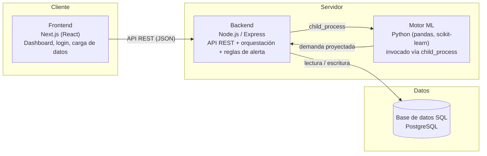

# NexuStock

Sistema inteligente de gestión y predicción de inventario para carnicerías de gestión independiente.

Proyecto APT (Capstone) — Ingeniería en Informática, Duoc UC, sede Alameda.

---

## Descripción

Las carnicerías de gestión independiente suelen decidir qué y cuánto comprar basándose casi exclusivamente en la intuición del encargado, sin un registro sistemático de ventas ni indicadores que respalden esa decisión. Esto genera dos problemas recurrentes de alto impacto económico: **quiebre de stock** (pérdida de ventas por agotamiento prematuro de productos perecibles) y **sobreinventario/merma** (compra excesiva de carne fresca que se descompone antes de venderse).

**NexuStock** ataca ambos problemas combinando dos componentes en una sola solución:

- Un **núcleo transaccional** clásico: gestión de productos, inventario, ventas y proveedores.
- Un **motor de Machine Learning** entrenado con datos históricos reales de ventas y compras, que proyecta la demanda futura por producto y periodo (semana/mes), considerando los tiempos de entrega de los proveedores (lead times) y la perecibilidad de la carne.

Con esa proyección, el sistema genera automáticamente recomendaciones de compra y alertas de riesgo (*Sobre stock / Suficiente / Riesgo de quiebre*), presentadas en un dashboard ejecutivo pensado para que una persona sin conocimientos técnicos pueda tomar la decisión con un vistazo.

- **A quién va dirigido:** dueños y encargados de carnicerías de gestión independiente — negocios pequeños, sin sistemas informáticos de apoyo previos.
- **Qué problema resuelve:** reemplaza el abastecimiento basado en intuición por uno apoyado en datos, reduciendo sistemáticamente tanto la merma por descomposición como las ventas perdidas por desabastecimiento.

---

## Tecnologías utilizadas

El sistema se divide en cuatro componentes, cada uno resuelto con la herramienta más adecuada a su función:

| Componente | Tecnología | Por qué |
|---|---|---|
| Frontend | **Next.js (React)** | Renderizado rápido de la interfaz; ideal para un dashboard con gráficos y formularios de carga de datos. |
| Backend | **Node.js / Express** | API REST liviana que orquesta la lógica de negocio y la ejecución del modelo predictivo. |
| Base de datos | **SQL — PostgreSQL** | Control transaccional robusto de inventario, ventas y compras (datos estructurados y consistentes). |
| Motor de Machine Learning | **Python** (pandas, scikit-learn / statsmodels, joblib) | Ecosistema estándar para análisis de datos y modelado predictivo. Se ejecuta como script invocado por el backend vía `child_process`, sin necesitar un servidor Python aparte. |

Comunicación entre componentes: el **frontend nunca llama directamente al motor Python** — siempre pasa por el backend, que centraliza el acceso a la base de datos y orquesta la ejecución del modelo.

Infraestructura y herramientas de apoyo:
- **Control de versiones:** Git / GitHub, con un repositorio compartido por el equipo.
- **Gestión de datos/ML:** Jupyter Notebook para el análisis exploratorio (EDA).

---

## Instrucciones para ejecutar el proyecto localmente

> El proyecto sigue una arquitectura de tres servicios (frontend, backend, motor ML) que comparten una única base de datos PostgreSQL. El motor Python no se ejecuta como servidor aparte: es invocado por el backend bajo demanda.

**Requisitos previos**
- Node.js LTS (v18 o superior) y npm
- Python 3.10 o superior
- PostgreSQL 14 o superior (local o vía Docker)
- Git

**1. Clonar el repositorio**
```bash
git clone <https://github.com/Blackmist02/NexuStock.git>
cd nexustock
```

**2. Base de datos**
```bash
# Crear la base de datos
createdb nexustock

# Ejecutar el script de esquema/migraciones (tablas: productos, ventas,
# compras, stock_historico, predicciones)
psql -d nexustock -f database/schema.sql (aun por completar)
```

**3. Backend (Node.js / Express)**
```bash
cd backend
npm install
cp .env.example .env      # completar DATABASE_URL, PORT y ruta al script Python
npm run dev                # levanta la API REST (por defecto en localhost:4000)
```

**4. Motor de Machine Learning (Python)**
```bash
cd ml
python3 -m venv venv
source venv/bin/activate   # en Windows: venv\Scripts\activate
pip install -r requirements.txt
```
El script del modelo no se ejecuta manualmente: el backend lo invoca vía `child_process` cada vez que se solicita una predicción o recomendación de compra.

**5. Frontend (Next.js)**
```bash
cd frontend
npm install
cp .env.example .env.local  # completar NEXT_PUBLIC_API_URL apuntando al backend
npm run dev                 # disponible en localhost:3000
```

**6. Uso**
Con los tres servicios corriendo, abrir `http://localhost:3000`, iniciar sesión y cargar los datos de ventas/compras (CSV o carga manual) para ver el dashboard de demanda proyectada, recomendaciones de compra y alertas por producto.

---

## Integrantes del equipo con sus roles

| Integrante | Rol | Responsabilidades principales |
|---|---|---|
| **Ignacio Mella** | Software Engineer | Arquitectura del sistema, diseño y administración de la base de datos SQL, lógica de backend del motor de movimientos e inventario, construcción de las APIs, seguridad básica y despliegue en la nube. |
| **Manuel Bustamante** | Data Scientist | Limpieza y procesamiento de datos históricos, análisis exploratorio (EDA), modelamiento predictivo de demanda, evaluación de métricas de precisión (MAE) y desarrollo del frontend/dashboard interactivo. |

---

## Metodología de trabajo del equipo

El desarrollo se aborda bajo una metodología ágil **Scrum**, organizada en **sprints quincenales** (de dos semanas) a lo largo de un ciclo efectivo de **10 semanas**, lo que permite construir de forma iterativa y en paralelo tanto el software transaccional como el pipeline de datos y el modelamiento predictivo.

Etapas de trabajo:

1. Definición del problema, alcance y requerimientos.
2. Investigación, recolección y preparación de datos históricos.
3. Diseño de la arquitectura del sistema y del modelo de base de datos relacional.
4. Análisis exploratorio de datos (EDA) y desarrollo del backend y la API REST.
5. Desarrollo del frontend y dashboard, en paralelo con el modelamiento de ML.
6. Construcción del motor de reglas de riesgo/recomendaciones e integración.
7. Despliegue en la nube, pruebas unitarias y de integración, mejoras y documentación.
8. Preparación de la defensa y presentación final.

El seguimiento del backlog y el avance de cada sprint se gestiona en una planilla de *Sprint Release Plan* compartida (historias por sprint, responsable, prioridad, estado y riesgos), y las responsabilidades quedan claramente diferenciadas por rol: Ignacio lidera la ingeniería de software clásica (arquitectura, base de datos, backend, despliegue) y Manuel lidera la línea analítica (datos, modelamiento predictivo, frontend del dashboard), con tareas compartidas en los puntos de integración crítica (motor de riesgos, integración de plataforma).

---

## Arquitectura de la solución

NexuStock separa responsabilidades en cuatro capas. El frontend nunca accede directamente al motor de Machine Learning ni a la base de datos: todo pasa por el backend, que actúa como orquestador central.



**Flujo de datos:**

1. El **frontend** (Next.js) gestiona login/sesión, carga de datos de ventas/compras y muestra el dashboard ejecutivo con gráficos de demanda, tabla de recomendaciones y semáforo de alertas.
2. El **backend** (Node.js/Express) expone la API REST de productos, ventas, compras, predicciones y alertas; persiste todo en la base de datos; y cuando se solicita una predicción, invoca el script Python entrenado vía `child_process`.
3. El **motor de Machine Learning** (Python) recibe los datos históricos + variables de calendario construidas manualmente (días para el 18 de septiembre, fin de semana largo, quincena/fin de mes), entrena/aplica un único **modelo de regresión** (comparando algoritmos clásicos de series de tiempo contra regresores supervisados) y devuelve la demanda proyectada por producto y periodo.
4. El **backend** compara esa demanda proyectada contra el stock actual mediante una **capa de reglas de negocio** (umbral + margen de seguridad configurable) — no un segundo modelo — y clasifica el estado en *Sobre stock*, *Suficiente* o *Riesgo de quiebre*, generando la recomendación de compra correspondiente.
5. La **base de datos** (PostgreSQL) almacena el catálogo de productos, el historial de ventas y compras (2022–2024), el stock reconstruido día a día y los resultados de cada predicción.

**Modelo de datos (tablas principales):** `productos`, `ventas`, `compras`, `stock_historico`, `predicciones`.
